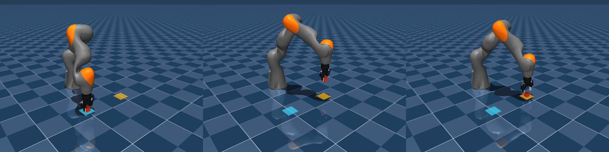
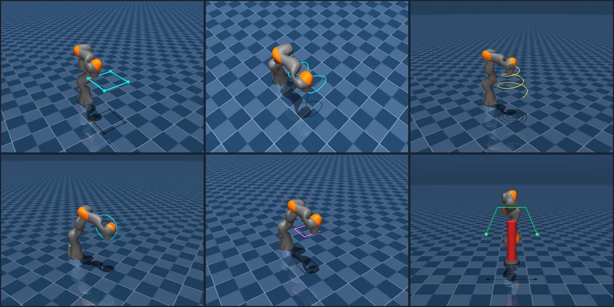

# iiwa7-mujoco

MuJoCo (MJCF) model for the KUKA LBR iiwa 7 R800, converted from the
ROS `iiwa_stack` URDF and tuned to `mujoco_menagerie/kuka_iiwa_14`
engineering conventions. Ships with a suite of motion-control demos
(gravity / inverse-dynamics feedforward + task-space PD), a unified
end-effector controller class, and a **Robotiq 2F-85 gripper** mounted
on the flange with a full real-physics pick-and-place demo.

## Installation

```bash
git clone <this repo>
cd iiwa7-mujoco
pip install mujoco scipy imageio imageio-ffmpeg
```

## Quick start

Interactive viewer (machine with a display):

```bash
python3 -m mujoco.viewer --mjcf=examples/scenes/iiwa7_scene.xml
```

Headless render of the flagship demo (display-less server, EGL):

```bash
MUJOCO_GL=egl python3 examples/demo_current_state_ff.py
# -> media/videos/demo_square_current_state_ff.mp4
```

Minimal Python API (joint-space):

```python
import mujoco, numpy as np
m = mujoco.MjModel.from_xml_path("iiwa7_mjcf/iiwa7_tuned.xml")
d = mujoco.MjData(m)
mujoco.mj_resetDataKeyframe(m, d, m.key("home").id)
d.ctrl[:] = np.array([0, 0.5, 0, -1.2, 0, 0.8, 0])
for _ in range(2000):
    mujoco.mj_step(m, d)
```

## Cartesian (end-effector) control

For pose-space control use `IiwaEEController` from `iiwa7_controller/`.
The high-level interface takes a **7-vector pose in the robot base
frame** and runs damped-least-squares IK internally:

```
pose7 = [x, y, z, qx, qy, qz, qw]
         └── position ──┘  └─── orientation ───┘
         metres, base     quaternion (xyzw, ROS / scipy / Eigen order)
         frame origin     identity = EE axes aligned with base axes
```

- Frame: **base_link (`iiwa_link_0`)**; translation in metres; rotation
  as a unit quaternion in **`(qx, qy, qz, qw)`** order (same as ROS /
  `scipy.spatial.transform.Rotation.as_quat()` / Eigen). The controller
  re-orders to MuJoCo's internal `(w, x, y, z)` on your behalf.
- The effective EE point is `iiwa_link_7` plus a 5 cm tool offset along
  link 7's local +Z (`attachment_site` in the MJCF). Pass a different
  `tool_offset=np.array([...])` to the constructor to change it.
- Useful reference quaternions (xyzw):
  - identity (EE axes = base axes): `[0, 0, 0, 1]`
  - tool pointing down (180° about base X): `[1, 0, 0, 0]`

```python
import mujoco, numpy as np
from iiwa7_controller import IiwaEEController

m = mujoco.MjModel.from_xml_path("examples/scenes/iiwa7_scene.xml")
d = mujoco.MjData(m)
mujoco.mj_resetDataKeyframe(m, d, m.key("home").id)

ctrl = IiwaEEController(m, d)   # default: current-state ID FF + task-PD

# command: EE at (0.5, 0.0, 0.55) m in base frame, tool pointing down
pose7 = np.array([0.5, 0.0, 0.55,   1.0, 0.0, 0.0, 0.0])  # xyzw = 180° about X
ctrl.set_ee_pose(pose7)          # solves IK, updates internal q_target

for _ in range(int(1.0 / m.opt.timestep)):   # run 1 s of sim
    ctrl.update(m, d)             # writes data.ctrl and data.qfrc_applied
    mujoco.mj_step(m, d)
```

Alternate entry points on the same controller:

| method                          | input                                   | notes                                                  |
|---------------------------------|-----------------------------------------|--------------------------------------------------------|
| `set_ee_pose(pose7)`            | `[x,y,z,qx,qy,qz,qw]` in base frame     | recommended — matches ROS / real-robot conventions     |
| `set_ee_target(pos, quat=None)` | world-frame pos (3,), optional wxyz (4) | lower-level; pass `quat=None` for 3-DOF position-only  |
| `set_joint_target(q)`           | `(7,)` joint vector                     | bypass IK entirely                                     |

Full working example: `examples/demo_ee_control.py`
(dynamic 6-DOF Lissajous) and `examples/demo_ee_orientation_cycle.py`
(fixed position, cycling tool orientation).

## Robotiq 2F-85 gripper

The repo ships a MuJoCo port of the Robotiq 2F-85 parallel gripper
(meshes converted from
[Danfoa/robotiq_2finger_grippers](https://github.com/Danfoa/robotiq_2finger_grippers))
mounted directly on the iiwa7 flange via the existing `attachment_site`
inside `iiwa_link_7`.

```
iiwa7_mjcf/
├── robotiq_2f85.xml             standalone gripper MJCF (testable alone)
├── iiwa7_with_gripper.xml       composite arm + gripper MJCF
└── meshes_2f85/                 6 OBJ (visual) + 5 STL (collision)
tools/convert_robotiq_meshes.py  DAE → OBJ/STL converter (reproducible)
examples/scenes/
├── iiwa7_with_gripper_scene.xml            minimal viewer scene
└── iiwa7_pickplace_gripper_scene.xml       pick-and-place scene + cube
```

### Kinematics

The real 2F-85 four-bar linkage is modelled with **one driver joint +
five equality-constraint followers**, faithfully reproducing the URDF
mimic structure:

| Joint                             | Relation to driver          | Range (rad)      |
|-----------------------------------|-----------------------------|------------------|
| `2f85_finger_joint` *(driver)*    | —                           | `[0, 0.8]`       |
| `right_outer_knuckle_joint`       | `= +finger_joint`           | `[0, 0.8]`       |
| `left_inner_knuckle_joint`        | `= +finger_joint`           | `[0, 0.8757]`    |
| `right_inner_knuckle_joint`       | `= +finger_joint`           | `[0, 0.8757]`    |
| `left_inner_finger_joint`         | `= −finger_joint`           | `[−0.8757, 0]`   |
| `right_inner_finger_joint`        | `= −finger_joint`           | `[−0.8757, 0]`   |

Measured pad-to-pad gap: **92 mm (open)** → **8 mm (closed)** — matches
the 85 mm stroke on the datasheet.

### Split control channels (matches the real robot)

Arm and gripper actuators live in **two separate `<actuator>` blocks**
inside `iiwa7_with_gripper.xml`. MuJoCo merges them at compile time,
but the source-level split mirrors the physical split channels (KUKA
FRI vs Robotiq Modbus RTU) so the architecture is explicit:

| `data.ctrl` index | Joint                 | Forwarded to (real system) |
|-------------------|-----------------------|----------------------------|
| `ctrl[0..6]`      | `iiwa_joint_1..7`     | KUKA FRI / KRC torque loop |
| `ctrl[7]`         | `2f85_finger_joint`   | Robotiq 2F-85 Modbus RTU    |

`ctrl[7] ∈ [0, 0.8]` rad: `0 = open` (85 mm), `0.8 = closed`.

### Pick-and-place task example

[](media/videos/pickplace_gripper.mp4)

*Left → right: grasp on the blue pad, lift & transit, descend to the orange place pad.*

Headless render (writes `media/videos/pickplace_gripper.mp4`):

```bash
MUJOCO_GL=egl python3 examples/demo_pickplace_gripper.py
```

The demo scripts a 12-second trajectory that moves a 40 mm / 60 g cube
from one floor pad to another:

```
home → pre-grasp → descend → close → lift → transit → place → release → retreat
```

Minimal Python pattern — **two commands per sim step**, one for the
arm (Cartesian pose) and one for the gripper (single setpoint):

```python
import mujoco, numpy as np
from iiwa7_controller import IiwaEEController

m = mujoco.MjModel.from_xml_path(
    "examples/scenes/iiwa7_pickplace_gripper_scene.xml")
d = mujoco.MjData(m)
mujoco.mj_resetDataKeyframe(m, d, m.key("home").id)

# tool_offset points from link_7 origin to the pad midpoint (the TCP)
ctrl = IiwaEEController(
    m, d, mode="gravity_ff", tool_offset=np.array([0., 0., 0.194]))

# Command #1: Cartesian pose for the arm (TCP at cube, tool down)
pose7 = np.array([0.50, -0.20, 0.02,   0.0, 1.0, 0.0, 0.0])  # xyzw, 180° about Y
ctrl.set_ee_pose(pose7)

# Command #2: gripper setpoint, independent of the arm channel
GRIPPER_OPEN, GRIPPER_CLOSE_CUBE = 0.0, 0.55

for _ in range(int(0.5 / m.opt.timestep)):
    ctrl.update(m, d)                # writes ctrl[0..6] (arm) + feedforward
    d.ctrl[7] = GRIPPER_CLOSE_CUBE   # overwrite the gripper slot every step
    mujoco.mj_step(m, d)
```

Real-physics contact (freejoint cube, μ=1.4) — not mocap — produces:

| Metric                   | Value          |
|--------------------------|----------------|
| XY displacement          | 399.8 / 400 mm |
| Landing error vs target  | 0.3 mm         |
| TCP-cube tracking (lift) | < 2 mm         |

### Mounting onto a different arm

`robotiq_2f85.xml` is self-contained — `<include>` it into your scene
and place the `2f85_base` body at your tool frame. Default orientation
has `+Z` pointing away from the flange toward the fingertips and
`±Y` as the jaw open/close axis.

## Repository layout

```
iiwa7-mujoco/
├── iiwa7_mjcf/                 plug-and-play MJCF model
│   ├── iiwa7.xml                 base MJCF (auto-converted from URDF)
│   ├── iiwa7_tuned.xml           menagerie-style tuned model
│   ├── iiwa7.urdf                cleaned URDF (intermediate)
│   ├── meshes/                   arm collision STLs + split visual OBJs
│   ├── robotiq_2f85.xml          standalone Robotiq 2F-85 gripper
│   ├── iiwa7_with_gripper.xml    composite arm + gripper
│   └── meshes_2f85/              gripper visual OBJ + collision STL
├── iiwa7_controller/           unified EE / joint controller
├── examples/
│   ├── demo_*.py                 demos (arm + gripper pick-and-place)
│   └── scenes/                   scene wrappers
├── tools/
│   ├── convert_iiwa7_to_mjcf.py  URDF -> MJCF pipeline
│   └── convert_robotiq_meshes.py DAE -> OBJ/STL for the gripper
├── media/                      thumbnails + recorded mp4s
└── TUNING_REPORT.md            parameter diff + tracking benchmarks
```

## Home-pose convention

The `home` keyframe matches **real-robot habits**, not the URDF default
vertical pose. On the physical iiwa, the teach-pendant reading at the
"elbow-bent-forward, flange-pointing-down" ready pose is
**J4 = −90°, J6 = +90°** (other joints at 0°).

(Why the signs disagree with a naive "bend forward by 90°" intuition:
the iiwa_stack URDF picks joint axes whose positive rotation direction
matches the KRC pendant's convention for J6 but **opposes** it for J4.
That mismatch is baked into the URDF; the ref trick below absorbs it
so `qpos = 0` means the same physical pose in sim and on hardware.)

To make the sim open in that pose out-of-the-box, `iiwa7_mjcf/iiwa7.xml`
sets `ref=+1.5708` on J4 and `ref=-1.5708` on J6. Per MuJoCo semantics
the physical joint angle is `qpos - ref`, so:

| qpos (J4, J6)  | physical angle (= pendant reading) | visual pose              |
|----------------|------------------------------------|--------------------------|
| `(0, 0)`       | `(−90°, +90°)`                     | real-robot ready pose    |
| `(+90°, −90°)` | `(0°, 0°)`                         | URDF fully-vertical pose |

The keyframes are therefore all zeros:

```xml
<key name="home" qpos="0 0 0 0 0 0 0" ctrl="0 0 0 0 0 0 0"/>
```

**Sim ↔ real mapping is direct.** Thanks to the `ref` choice,
`qpos[J4]` and `qpos[J6]` in sim are already displaced from the
pendant reading by exactly `ref`, so:

```
pendant_reading_deg = rad2deg(qpos - ref)
```

and pendant = `qpos - ref`. No separate offset needs to be
book-kept at the sim ↔ real boundary — just subtract `ref`.

**Revert to vanilla URDF semantics** (`qpos` == encoder readings):

1. Delete `ref="1.5708"` and `ref="-1.5708"` from J4 / J6 in
   `iiwa7_mjcf/iiwa7.xml`.
2. Restore the keyframe in `iiwa7_mjcf/iiwa7_tuned.xml`,
   `examples/scenes/iiwa7_scene.xml`, and
   `examples/scenes/iiwa7_square_scene.xml`:

   ```xml
   <key name="home" qpos="0 0 0 1.5708 0 -1.5708 0" ctrl="0 0 0 1.5708 0 -1.5708 0"/>
   ```

After these edits, `qpos` is 1:1 with real-robot encoders; the cost is
that opening the viewer without a keyframe reset shows the vertical
URDF pose.

## Tuning highlights

`iiwa7_tuned.xml` vs the auto-converted `iiwa7.xml`:

| Parameter           | Base `iiwa7.xml`      | Tuned `iiwa7_tuned.xml`                      | Source            |
|---------------------|-----------------------|----------------------------------------------|-------------------|
| Actuator type       | `<position>` pure P   | `<general>` gaintype=fixed, biastype=affine  | menagerie         |
| kp / kd             | 400/200/100, no kd    | kp=2000 uniform, kd=200 via `biasprm`        | menagerie         |
| forcerange          | none                  | J1/2: ±176, J3-5: ±110, J6/7: ±40 N·m        | iiwa7 datasheet   |
| armature            | none                  | 0.1                                          | motor rotor       |
| contact exclude     | none                  | 7 pairs                                      | menagerie         |
| attachment site     | none                  | on link7 at (0, 0, 0.05)                     | tool mount        |
| Joint damping       | 0.5 (from URDF)       | 0.5 (kept)                                   | passive stability |
| Link masses/inertia | iiwa7 URDF values     | unchanged                                    | iiwa7 ≠ iiwa14    |

Full diff in [`TUNING_REPORT.md`](TUNING_REPORT.md).

## Control stack

The best controller (`demo_current_state_ff.py`) combines
inverse-dynamics feedforward evaluated at the current state with a
task-space PD folded into commanded acceleration:

1. Precompute IK joint targets at 30 Hz, fit per-joint cubic splines
   for a C² reference `(q_d, q̇_d, q̈_d)`.
2. At every sim step (500 Hz), evaluate the spline.
3. Form a commanded acceleration
   `q̈_cmd = q̈_d + Kp·(q_d − q) + Kd·(q̇_d − q̇)` (`Kp=400, Kd=40`).
4. Call `mj_inverse` at the **current** state `(q, q̇, q̈_cmd)` to obtain
   τ_ff; write it to `data.qfrc_applied`.
5. Actuator PD with `ctrl = q_d` closes the residual error.

## Tracking benchmarks

30 × 30 cm horizontal square, 2 loops, actuator-in-loop simulation:

| Controller                                       | mean   | p95    | max    | vs legacy |
|--------------------------------------------------|--------|--------|--------|-----------|
| legacy (position, kp=400/200/100)                | 94.81  | 156.49 | 169.55 | 1.0×      |
| tuned (general, kp=2000 kd=200)                  | 22.28  | 30.37  | 31.90  | 4.3×      |
| tuned + gravity FF                               | 10.75  | 15.56  | 22.18  | 8.8×      |
| tuned + full ID FF (reference state)             | 8.72   | 12.55  | 17.91  | 10.9×     |
| **tuned + current-state ID FF + task-space PD**  | **5.48** | **9.63**  | **12.28** | **17.3×** |

All values in millimetres. See [`TUNING_REPORT.md`](TUNING_REPORT.md)
for the raw logs.

## Demo gallery

Six representative motion demos running under the unified
`IiwaEEController` (current-state ID FF + task-space PD). Rendered
headlessly via `MUJOCO_GL=egl`, H.264 MP4, 720×540 @ 30 fps. Click the
gallery to open the flagship square MP4; individual MP4s are listed
beneath.

[](media/videos/demo_square_current_state_ff.mp4)

*Top row, left → right:* horizontal 30 × 30 cm square (flagship, mean
**5.48 mm** / max **12.28 mm**) · figure-8 · ascending spiral.
*Bottom row, left → right:* vertical circle · 6-DOF orientation-locked
square · obstacle arc around a cylinder.

| Demo                             | Script                                   | Video                                                |
|----------------------------------|------------------------------------------|------------------------------------------------------|
| Horizontal square (flagship)     | `demo_current_state_ff.py`               | `media/videos/demo_square_current_state_ff.mp4`      |
| Figure-8 / spiral / v-circle     | `demo_motions_v2.py`                     | `media/videos/demo_motion_{figure8,spiral,vcircle,vrect}.mp4` |
| 6-DOF orientation-locked square  | `demo_motion_sq6dof` (in `demo_motions_v2.py`) | `media/videos/demo_motion_sq6dof.mp4`          |
| Obstacle arc around a cylinder   | `demo_motion_obstacle` (in `demo_motions_v2.py`) | `media/videos/demo_motion_obstacle.mp4`      |
| 3D Lissajous (6-DOF pose API)    | `demo_ee_control.py`                     | `media/videos/demo_ee_control.mp4`                   |
| Tool orientation cycle           | `demo_ee_orientation_cycle.py`           | `media/videos/demo_ee_orientation_cycle.mp4`         |
| **6-axis Cartesian probe (±X,±Y,±Z)** | `demo_cartesian_axes.py`            | `media/videos/demo_cartesian_axes.mp4`               |
| **Gripper pick-and-place**       | `demo_pickplace_gripper.py`              | `media/videos/pickplace_gripper.mp4`                 |

All demos target the same `IiwaEEController.set_ee_pose(pose7)` API —
the controller is what stays constant; the trajectory is just a
`(t → pose7)` function supplied by each script.

## Credits

- URDF source: [IFL-CAMP/iiwa_stack](https://github.com/IFL-CAMP/iiwa_stack)
- Tuning reference: [google-deepmind/mujoco_menagerie](https://github.com/google-deepmind/mujoco_menagerie) (`kuka_iiwa_14`)
- Gripper source: [Danfoa/robotiq_2finger_grippers](https://github.com/Danfoa/robotiq_2finger_grippers) (`robotiq_2f_85_gripper_visualization`)
