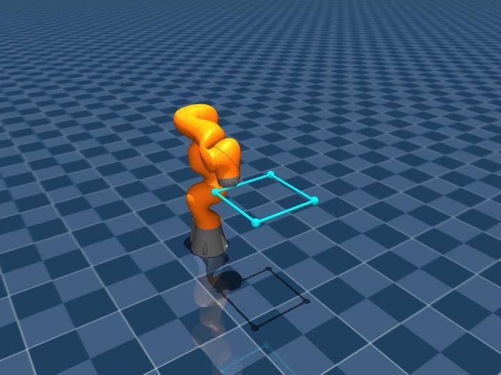
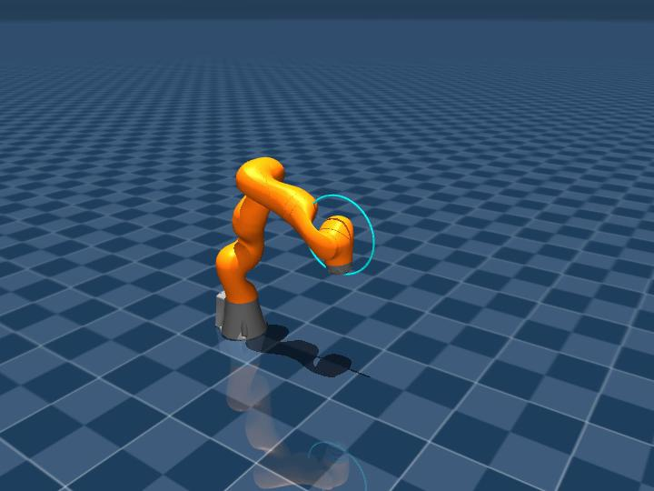
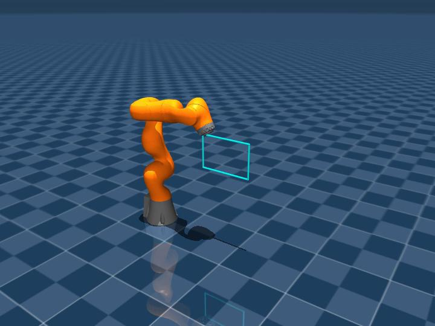
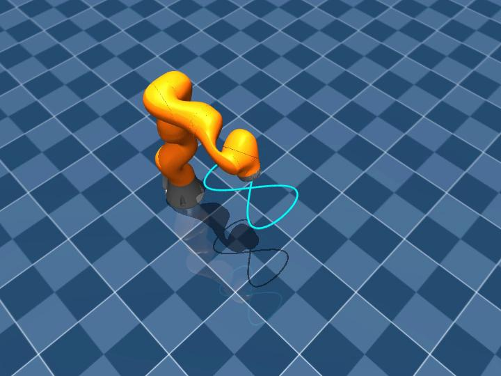
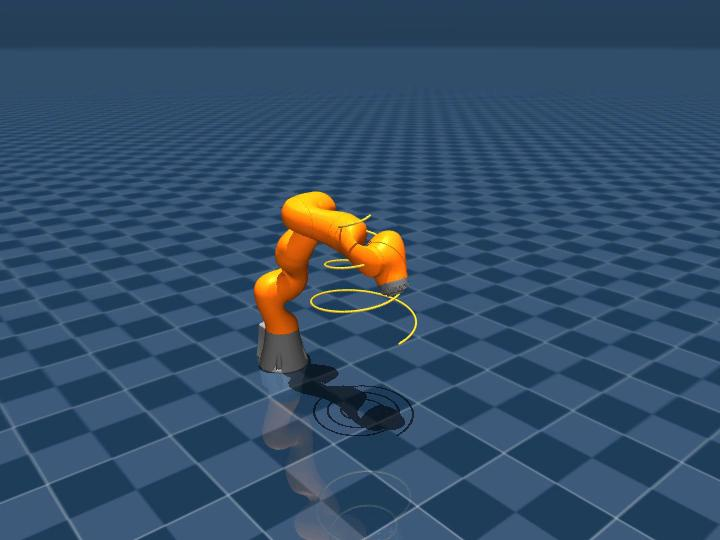
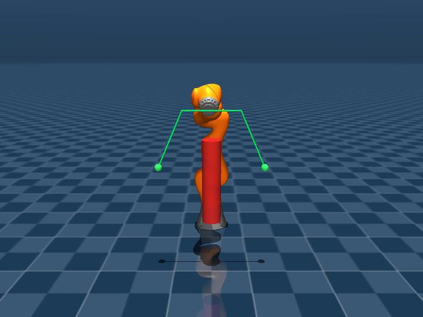
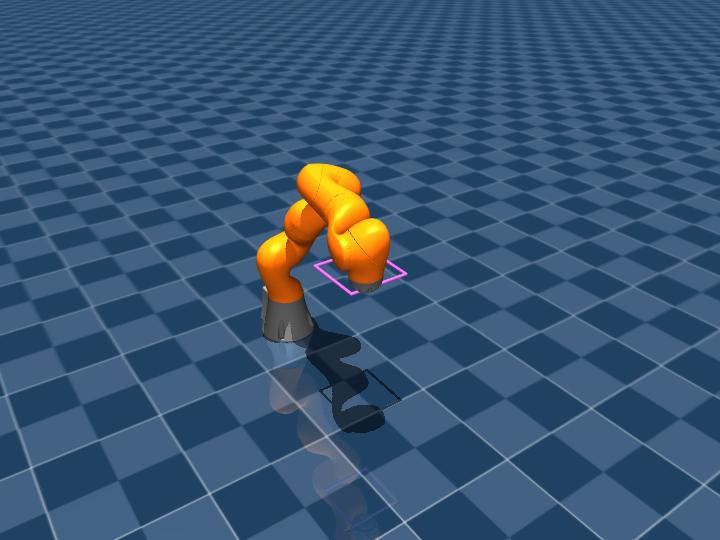

# iiwa7-mujoco

> KUKA LBR iiwa 7 R800 的 MuJoCo (MJCF) 仿真模型与一组运动控制 demo。  
> KUKA LBR iiwa 7 R800 MuJoCo (MJCF) simulation model with a set of motion-control demos.

**语言 / Language**: [🇨🇳 中文](#-中文) | [🇬🇧 English](#-english)

---

<a id="-中文"></a>

## 🇨🇳 中文

### 简介

本仓库把 ROS `iiwa_stack` 中的 KUKA iiwa 7 R800 URDF 转换并精调为可在 MuJoCo 中直接仿真的 MJCF 模型，并提供一整套基于该模型的运动控制 demo。所有动作均在无头 EGL 渲染环境下录制为 MP4，无屏服务器可直接复现。

精调参照了 [`mujoco_menagerie/kuka_iiwa_14`](https://github.com/google-deepmind/mujoco_menagerie/tree/main/kuka_iiwa_14) 的工程做法。

### 文件结构

```
iiwa7-mujoco/
├── README.md                          本文件（双语）
├── TUNING_REPORT.md                   精调参数对比表 + 跟踪误差基准
├── convert_iiwa7_to_mjcf.py           URDF → MJCF 可复现脚本（需原始 iiwa_stack 源）
├── demo_record.py                     基础 passive + 正弦扫动 demo
├── demo_square.py                     IK 方形轨迹 (kinematic playback)
├── demo_tuning_compare.py             legacy 与 tuned 控制器对比
├── demo_gravity_ff.py                 重力前馈
├── demo_full_id_ff.py                 参考态完整逆动力学前馈
├── demo_current_state_ff.py           当前态 ID FF + task-PD (最佳控制器)
├── demo_motions.py                    3 个动作：水平方形/圆/抓取
├── demo_motions_v2.py                 5 个动作：8字/螺旋/避障/堆叠/6-DOF
├── iiwa7/                             MJCF 模型文件（仅 XML/URDF）
│   ├── iiwa7.urdf                       剥 ROS 标签的纯 URDF（中间产物）
│   ├── iiwa7.xml                        基础 MJCF（URDF 自动转换）
│   ├── iiwa7_tuned.xml                  menagerie 风格精调模型 ⭐
│   ├── iiwa7_scene.xml                  基础场景（robot + ground + actuator）
│   ├── iiwa7_clean_scene.xml            精调场景
│   ├── iiwa7_square_scene.xml           方形轨迹参考场景
│   ├── iiwa7_tuned_square_scene.xml     精调版方形场景
│   ├── iiwa7_obstacle_scene.xml         避障场景（红柱）
│   ├── iiwa7_stack_scene.xml            双 cube 堆叠场景
│   └── iiwa7_pickplace_scene.xml        抓放场景
├── media/videos/                      demo 视频（MP4）
│   └── *.mp4                            所有录制视频
└── meshes/iiwa7/                      visual + collision STL mesh
```

### 快速上手

**有屏本机**：
```bash
git clone <this repo>
cd iiwa7-mujoco
pip install mujoco
python3 -m mujoco.viewer --mjcf=iiwa7/iiwa7_tuned_square_scene.xml
```

**无头服务器（录视频）**：
```bash
pip install mujoco scipy imageio imageio-ffmpeg
MUJOCO_GL=egl python3 demo_motions_v2.py
```

**最简 Python API**：
```python
import mujoco, numpy as np
m = mujoco.MjModel.from_xml_path("iiwa7/iiwa7_tuned.xml")
d = mujoco.MjData(m)
mujoco.mj_resetDataKeyframe(m, d, m.key("ready").id)
d.ctrl[:] = np.array([0, 0.5, 0, -1.2, 0, 0.8, 0])
for _ in range(2000):
    mujoco.mj_step(m, d)
```

### 精调亮点（对照 menagerie iiwa14）

| 参数 | 原版 `iiwa7.xml` | 精调版 `iiwa7_tuned.xml` | 来源 |
|---|---|---|---|
| actuator 类型 | `<position>` 纯 P | `<general>` gaintype=fixed biastype=affine | menagerie |
| kp / kd | 400/200/100, 无 kd | 2000 统一, kd=200 (biasprm) | menagerie |
| forcerange | 无 | J1/2: ±176, J3-5: ±110, J6/7: ±40 Nm | iiwa7 datasheet |
| armature | 无 | 0.1 | 电机转子惯量 |
| contact exclude | 无 | 7 对 | menagerie |
| attachment_site | 无 | link7 at (0,0,0.05) | 工具挂载点 |
| `<default>` class | 无 | iiwa / joint1..7 分级 | menagerie |
| 关节 damping | 0.5 (URDF) | **保留 0.5** | 保证 passive 稳定 |
| 质量 / 惯量 | iiwa7 URDF 原值 | **不动** | iiwa7 ≠ iiwa14 |

详细参数 diff 见 [`TUNING_REPORT.md`](TUNING_REPORT.md)。

### 控制器栈

**当前态 ID FF + task-space PD**（最佳控制器，`demo_current_state_ff.py`）：

1. IK 目标关节位姿在帧率（30 Hz）预计算，用 scipy `CubicSpline` 拟合成 C² 参考轨迹
2. 每 sim step (500 Hz) 评估 spline 得 `(q_d, q̇_d, q̈_d)`
3. Task-space PD 折进 commanded acceleration：  
   `q̈_cmd = q̈_d + Kp_tsk·(q_d−q_actual) + Kd_tsk·(q̇_d−q̇_actual)` (`Kp=400, Kd=40`)
4. 在**当前状态** (q_actual, q̇_actual, q̈_cmd) 调 `mj_inverse` 得 τ_ff
5. `data.qfrc_applied = τ_ff`；actuator PD 用 `ctrl = q_d` 做残差校正

### 跟踪精度闭环数据

30×30 cm 水平方形轨迹，2 圈，actuator-in-loop 仿真：

| 版本 | mean | p95 | max | vs 原版 |
|---|---|---|---|---|
| legacy (position, kp=400/200/100) | 94.81 mm | 156.49 | 169.55 | 1.0× |
| tuned (general, kp=2000 kd=200) | 22.28 | 30.37 | 31.90 | 4.3× |
| tuned + gravity FF | 10.75 | 15.56 | 22.18 | 8.8× |
| tuned + full ID FF (ref state) | 8.72 | 12.55 | 17.91 | 10.9× |
| **tuned + current-state ID FF + task-PD** | **5.48** | **9.63** | **12.28** | **17.3×** |

### 动作覆盖

见下方 [效果展示 / Demo Videos](#-效果展示--demo-videos)。

### 致谢

- URDF 源：[IFL-CAMP/iiwa_stack](https://github.com/IFL-CAMP/iiwa_stack)
- 精调参考：[google-deepmind/mujoco_menagerie](https://github.com/google-deepmind/mujoco_menagerie) (kuka_iiwa_14)

⬆️ 跳转到 [🇬🇧 English](#-english)

---

<a id="-english"></a>

## 🇬🇧 English

### Overview

This repo converts the KUKA iiwa 7 R800 URDF from ROS `iiwa_stack` into a MuJoCo MJCF model that runs out-of-the-box, with a full suite of motion-control demos recorded headlessly via EGL on a display-less server.

Tuning follows the engineering conventions of [`mujoco_menagerie/kuka_iiwa_14`](https://github.com/google-deepmind/mujoco_menagerie/tree/main/kuka_iiwa_14).

### File structure

```
iiwa7-mujoco/
├── README.md                          this file (bilingual)
├── TUNING_REPORT.md                   parameter-diff table + tracking benchmarks
├── convert_iiwa7_to_mjcf.py           URDF → MJCF pipeline (needs iiwa_stack source)
├── demo_record.py                     basic passive + sinusoidal sweep
├── demo_square.py                     IK square trajectory (kinematic playback)
├── demo_tuning_compare.py             legacy vs tuned controller A/B
├── demo_gravity_ff.py                 gravity feedforward
├── demo_full_id_ff.py                 reference-state full inverse-dynamics FF
├── demo_current_state_ff.py           current-state ID FF + task-PD (best)
├── demo_motions.py                    3 motions: hsquare / vcircle / pickplace
├── demo_motions_v2.py                 5 motions: fig8 / spiral / obstacle / stack / 6-DOF
├── iiwa7/                             MJCF assets (XML/URDF only)
│   ├── iiwa7.urdf                       cleaned pure URDF (intermediate)
│   ├── iiwa7.xml                        base MJCF (auto-converted)
│   ├── iiwa7_tuned.xml                  menagerie-style tuned model ⭐
│   ├── iiwa7_scene.xml                  basic scene (robot + ground + actuator)
│   ├── iiwa7_clean_scene.xml            tuned scene
│   ├── iiwa7_square_scene.xml           reference square overlay scene
│   ├── iiwa7_tuned_square_scene.xml     tuned + square overlay
│   ├── iiwa7_obstacle_scene.xml         pillar obstacle scene
│   ├── iiwa7_stack_scene.xml            two-cube stacking scene
│   └── iiwa7_pickplace_scene.xml        pick-and-place scene
├── media/videos/                      demo videos (MP4)
│   └── *.mp4                            all rendered clips
└── meshes/iiwa7/                      visual + collision STL
```

### Quick start

**Local machine with a display**:
```bash
git clone <this repo>
cd iiwa7-mujoco
pip install mujoco
python3 -m mujoco.viewer --mjcf=iiwa7/iiwa7_tuned_square_scene.xml
```

**Headless server (record videos)**:
```bash
pip install mujoco scipy imageio imageio-ffmpeg
MUJOCO_GL=egl python3 demo_motions_v2.py
```

**Minimal Python API**:
```python
import mujoco, numpy as np
m = mujoco.MjModel.from_xml_path("iiwa7/iiwa7_tuned.xml")
d = mujoco.MjData(m)
mujoco.mj_resetDataKeyframe(m, d, m.key("ready").id)
d.ctrl[:] = np.array([0, 0.5, 0, -1.2, 0, 0.8, 0])
for _ in range(2000):
    mujoco.mj_step(m, d)
```

### Tuning highlights (vs menagerie iiwa14)

| Parameter | Original `iiwa7.xml` | Tuned `iiwa7_tuned.xml` | Rationale |
|---|---|---|---|
| Actuator type | `<position>` pure P | `<general>` gaintype=fixed biastype=affine | menagerie |
| kp / kd | 400/200/100, no kd | 2000 uniform, kd=200 via biasprm | menagerie |
| forcerange | none | J1/2: ±176, J3-5: ±110, J6/7: ±40 Nm | iiwa7 datasheet |
| armature | none | 0.1 | motor rotor inertia |
| contact exclude | none | 7 pairs | menagerie |
| attachment_site | none | on link7 at (0,0,0.05) | tool mount point |
| `<default>` classes | none | iiwa / joint1..7 hierarchy | menagerie |
| Joint damping | 0.5 (from URDF) | **kept at 0.5** | passive-sim stability |
| Link masses / inertia | iiwa7 URDF values | **unchanged** | iiwa7 ≠ iiwa14 |

Full diff: see [`TUNING_REPORT.md`](TUNING_REPORT.md).

### Control stack

**Current-state ID FF + task-space PD** (best controller, `demo_current_state_ff.py`):

1. IK joint targets precomputed at frame rate (30 Hz), fit with scipy `CubicSpline` for a C² reference trajectory
2. At every sim step (500 Hz) evaluate the spline for `(q_d, q̇_d, q̈_d)`
3. Task-space PD folded into commanded acceleration:  
   `q̈_cmd = q̈_d + Kp_tsk·(q_d − q_actual) + Kd_tsk·(q̇_d − q̇_actual)` (`Kp=400, Kd=40`)
4. Evaluate `mj_inverse` at **current state** `(q_actual, q̇_actual, q̈_cmd)` → τ_ff
5. `data.qfrc_applied = τ_ff`; actuator PD with `ctrl = q_d` closes residual error

### Tracking benchmarks

30×30 cm horizontal square, 2 loops, actuator-in-loop simulation:

| Model | mean | p95 | max | vs legacy |
|---|---|---|---|---|
| legacy (position, kp=400/200/100) | 94.81 mm | 156.49 | 169.55 | 1.0× |
| tuned (general, kp=2000 kd=200) | 22.28 | 30.37 | 31.90 | 4.3× |
| tuned + gravity FF | 10.75 | 15.56 | 22.18 | 8.8× |
| tuned + full ID FF (reference state) | 8.72 | 12.55 | 17.91 | 10.9× |
| **tuned + current-state ID FF + task-PD** | **5.48** | **9.63** | **12.28** | **17.3×** |

### Motion coverage

See [Demo Videos / 效果展示](#-效果展示--demo-videos) below.

### Credits

- URDF source: [IFL-CAMP/iiwa_stack](https://github.com/IFL-CAMP/iiwa_stack)
- Tuning reference: [google-deepmind/mujoco_menagerie](https://github.com/google-deepmind/mujoco_menagerie) (kuka_iiwa_14)

⬆️ Jump to [🇨🇳 中文](#-中文)

---

<a id="-效果展示--demo-videos"></a>

## 🎬 效果展示 / Demo Videos

Each clip is rendered headlessly on a display-less server via `MUJOCO_GL=egl`,
H.264 MP4, 720×540 @ 30 fps.

**Click any thumbnail — GitHub opens its built-in video player inline.**

每段视频均为 `MUJOCO_GL=egl` 无头渲染，H.264 MP4，720×540 @ 30 fps。
**点击任意缩略图，GitHub 会打开内置视频播放器进行播放。**

### 1. 水平方形（精调控制器） / Horizontal square (best controller)

> mean **5.48 mm** / max **12.28 mm** — 30×30 cm 水平面方形，2 圈  
> 展示完整控制器栈：current-state ID FF + task-PD  
> flagship demo — 30×30 cm horizontal square traced twice

[](media/videos/demo_square_current_state_ff.mp4)

### 2. 垂直圆 / Vertical circle

> mean 5.65 mm / max 14.24 mm — XZ 平面半径 15 cm，2 圈  
> EE traces a circle of radius 15 cm in the XZ plane

[](media/videos/demo_motion_vcircle.mp4)

### 3. 垂直矩形 / Vertical rectangle

> mean 9.13 mm / max 18.61 mm — XZ 平面 30×20 cm，2 圈  
> EE traces a 30×20 cm rectangle in the XZ plane, 2 loops

[](media/videos/demo_motion_vrect.mp4)

### 4. 8 字形 / Figure-8 (Lissajous)

> mean 8.81 mm / max 26.39 mm — XY 水平面 Lissajous：`x=cx+A cos t, y=cy+B sin 2t`  
> Horizontal XY Lissajous figure-8

[](media/videos/demo_motion_figure8.mp4)

### 5. 螺旋上升 / Conical spiral

> mean 9.46 mm / max 19.27 mm — 半径 0.20→0.05 m，Z 0.35→0.75 m，3 圈  
> Radius shrinks 0.20→0.05 m while Z rises 0.35→0.75 m, 3 turns

[](media/videos/demo_motion_spiral.mp4)

### 6. 避障 / Obstacle avoidance

> mean 7.12 mm / max 14.78 mm — 绕过红色垂直障碍柱，Z 方向飞越  
> Arcs over a red vertical pillar, lifting to Z=0.85 for safety margin

[](media/videos/demo_motion_obstacle.mp4)

### 7. 6-DOF 方形（末端锁定朝下） / 6-DOF square (tool pointing down)

> mean 5.85 mm — 20×20 cm 水平方形，EE 姿态锁定 quat=[0,1,0,0]  
> Horizontal 20×20 cm square with end-effector orientation locked to point downward  
> Uses extended 6-DOF damped-least-squares IK (3×7 pos + 3×7 rot Jacobians, quaternion error)

[](media/videos/demo_motion_sq6dof.mp4)

---

⬆️ Back to top / 回到顶部：[🇨🇳 中文](#-中文) · [🇬🇧 English](#-english)
